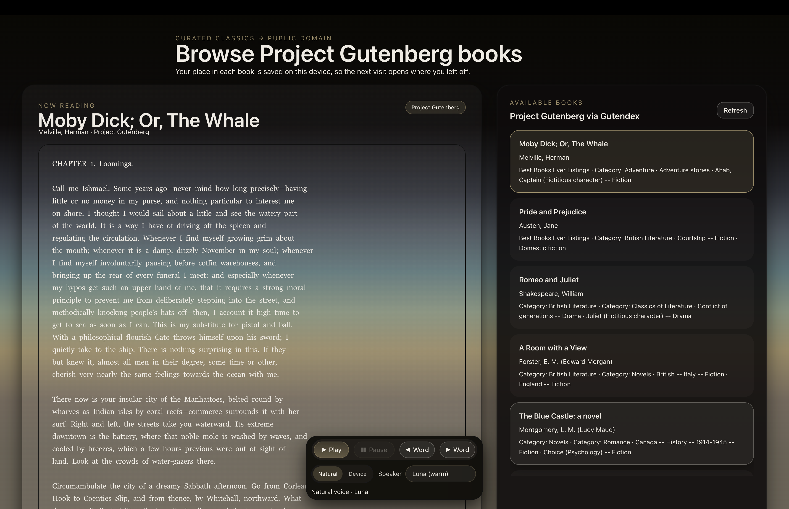

# chic

<p align="center">
  
</p>

Read Project Gutenberg books in the browser with synced text-to-speech, word highlighting, dictionary lookups, and saved reading progress.

Live at [chic.geoffsee.com](https://chic.geoffsee.com).

## Features

- Browse Project Gutenberg books through the app API (paginated, lean catalog payloads)
- Infinite-scroll library with title/author search
- Read along with word-level highlighting while audio plays
- Two speech engines:
  - **Browser** — `speechSynthesis` (works offline after the book is loaded)
  - **Cloud** — Cloudflare Workers AI / Deepgram Aura-2 (natural multi-speaker English voices)
- Tap a word for a short definition (Free Dictionary API, cached in KV)
- Resume where you left off (progress stored in the browser)

## Stack

| Layer | Tech |
| --- | --- |
| UI | React 19, Chakra UI |
| Local server | Bun (`src/index.tsx`, port 4000) |
| Production | Cloudflare Workers + static assets |
| Catalog / text | API-ingested Gutendex catalog + Gutenberg plain text |
| TTS | Workers AI `@cf/deepgram/aura-2-en` |
| Cache | Cloudflare KV (`GUTENBERG_KV`) |

## Quick start

Requires [Bun](https://bun.sh/).

```bash
bun install
bun run dev
```

Open the URL Bun prints (default `http://localhost:4000`).

### Scripts

| Script | Description |
| --- | --- |
| `bun run dev` | Hot-reload frontend + local API |
| `bun run build` | Production browser bundle → `dist/` |
| `bun run start` | Serve the app in production mode via Bun |
| `bun run deploy` | Build and deploy with Wrangler |
| `bun test` | Run unit tests in `tests/` |

## API routes

Shared handlers live under `functions/api/` and are wired for both Bun (dev) and the Worker (`index.ts`).

| Route | Method | Purpose |
| --- | --- | --- |
| `/api/gutenberg-books` | `GET` | Paginated catalog (`?page=1&search=dickens&force=true`) |
| `/api/book-text` | `POST` | Fetch prepared plain text for a book summary |
| `/api/tts` | `GET` / `POST` | Cloud TTS (Aura-2); requires AI binding in production |
| `/api/word-info` | `GET` / `POST` | Dictionary definition for a word (+ optional context) |

## Deploy

1. Copy `example.wrangler.toml` to `wrangler.toml` (or edit the existing one).
2. Set your KV namespace IDs for `GUTENBERG_KV`.
3. Keep the `[ai]` binding if you want cloud TTS.
4. Point `routes` at your domain (or enable `workers_dev`).
5. Deploy:

```bash
bun run deploy
```

Cloud TTS needs the Workers AI binding. Without it, the app still works with the browser speech engine.

## Project layout

```
src/                 React app, speech player, book services
functions/api/       Worker/Bun API handlers (books, text, TTS, word info)
index.ts             Cloudflare Worker entry (routes + assets)
tests/               Bun test suites for speech, TTS, Gutenberg text, progress
example.wrangler.toml  Deploy config template
```

## Speech architecture

Playback is driven by `ReadingPlayer` (`src/speech/`), which chunks text and drives either:

- `BrowserSpeechEngine` — Web Speech API + boundary events for highlights
- `CloudSpeechEngine` — fetches audio from `/api/tts` and maps timing for highlights

The React hook `useReadingPlayer` connects that player to the UI in `App.tsx`.
